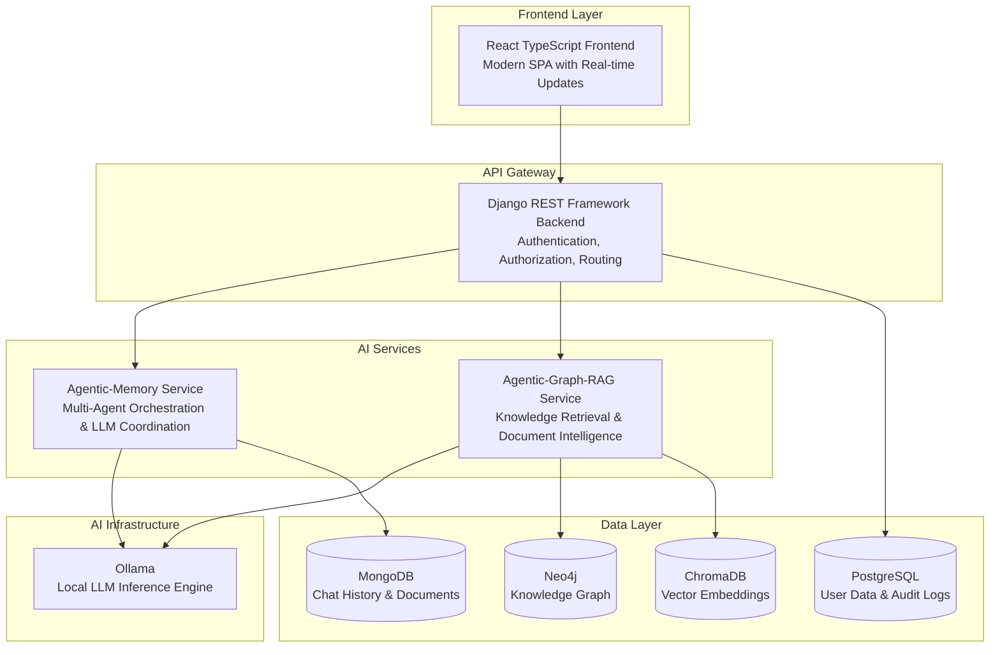
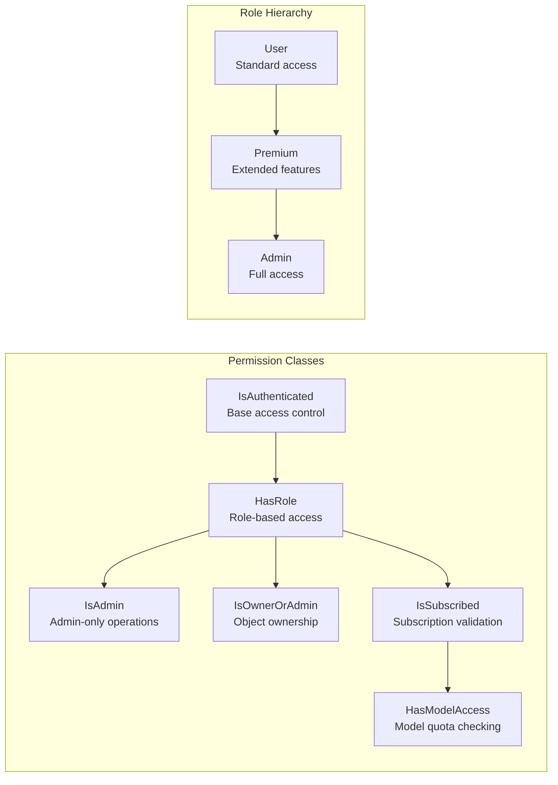
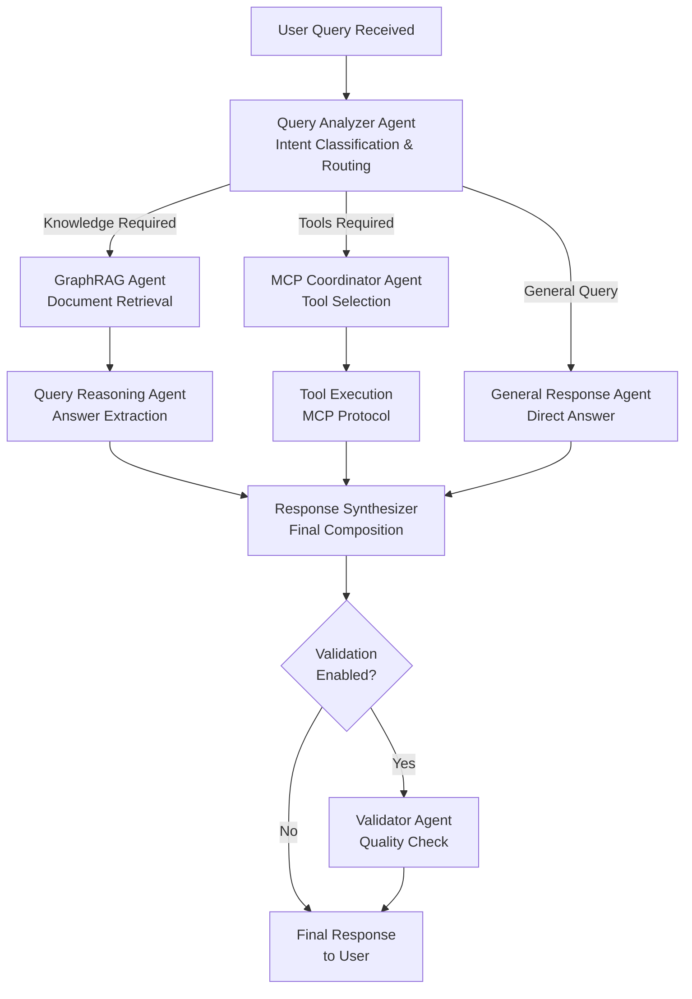
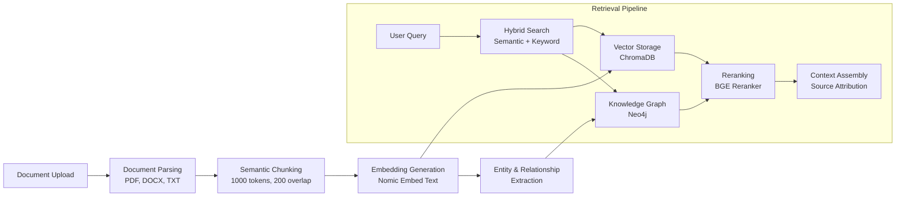

# CogniVox: Technical Documentation & Application Notes

**Version:** 2.0  
**Classification:** Technical & Commercial Reference  
**Audience:** Technical Leadership, Sales Engineering, Executive Stakeholders  
**Last Updated:** January 2026

---

## Abstract

CogniVox is an enterprise-grade, self-hosted AI assistant platform designed to address the critical need for data sovereignty in regulated industries. By integrating Retrieval Augmented Generation (RAG), multi-agent orchestration, and the Model Context Protocol (MCP), CogniVox delivers advanced conversational capabilities without compromising data privacy. This document outlines the technical architecture, security measures, and implementation details of the CogniVox platform, providing a comprehensive guide for technical stakeholders.


## Executive Summary

CogniVox represents a paradigm shift in enterprise AI assistant technology, delivering a comprehensive, self-hosted intelligent platform that combines advanced Retrieval Augmented Generation (RAG) with sophisticated multi-agent orchestration and seamless Model Context Protocol (MCP) integration. Unlike cloud-dependent alternatives that require data transmission to external servers, CogniVox operates entirely within organizational boundaries, ensuring complete data sovereignty while delivering enterprise-grade conversational AI capabilities.

The platform is architected around a modern microservices design philosophy, with each component purpose-built for its specific function while maintaining seamless interoperability across the system. This architectural approach enables organizations to deploy a production-ready AI assistant that understands context, retrieves knowledge from proprietary document repositories, executes complex multi-step reasoning tasks, and integrates with existing enterprise tools through standardized protocols.

CogniVox addresses the growing enterprise demand for AI capabilities that do not compromise on security, compliance, or operational control. Regulated industries including healthcare, financial services, defense, and legal sectors face stringent requirements around data handling that make cloud-only solutions impractical or impossible. CogniVox fills this critical gap by providing capabilities that rival or exceed cloud alternatives while maintaining complete organizational control over all data and processing.

> [!IMPORTANT]
> **UNCOMPROMISING DATA SOVEREIGNTY.**
>
> CogniVox stands alone as the **ultimate fortress for enterprise intelligence**. We don't just prioritize privacy; we **guarantee** it. By architecting a complete AI ecosystem that lives and breathes entirely within your secure perimeter, CogniVox eliminates the "Cloud Compromise." 
>
> **Your Data. Your Infrastructure. Your Rules.**
>
> Experience the raw power of state-of-the-art AI without a single byte of sensitive information ever leaving your control. For healthcare, finance, and defense sectors, this is not merely an upgrade—it is the **only** path to secure, sovereign AI adoption.

The platform's intelligent document processing pipeline transforms unstructured content into queryable knowledge structures, while its multi-agent architecture ensures that user queries are routed to specialized reasoning systems optimized for their specific requirements. Whether users need general conversational assistance, deep knowledge retrieval from organizational documents, or execution of complex workflows through integrated tools, CogniVox delivers contextually appropriate responses with source attribution and explainable reasoning.

---

## Table of Contents

| Section No. | Section Title |
| :--- | :--- |
| 1 | [Introduction](#introduction) |
| 2 | [Problem Statement](#problem-statement) |
| 3 | [Architecture Overview](#architecture-overview) |
| 4 | [Technology Stack](#technology-stack) |
| 5 | [Security Architecture](#security-architecture) |
| 6 | [Core Features & Efficiency Drivers](#core-features--efficiency-drivers) |
| 7 | [Competitive Differentiation](#competitive-differentiation) |
| 8 | [Deployment & Scalability](#deployment--scalability) |
| 9 | [Integration Capabilities](#integration-capabilities) |
| 10 | [Performance Benchmarks](#performance-benchmarks) |

---

## Introduction

The rapid advancement of Large Language Models (LLMs) has transformed the landscape of enterprise productivity, offering unprecedented capabilities in natural language processing and knowledge retrieval. However, the adoption of cloud-based AI solutions often necessitates the transmission of sensitive data to external servers, posing significant compliance and security risks. CogniVox introduces a robust, on-premise alternative that harnesses the power of local LLM inference and a microservices architecture. It enables organizations to deploy intelligent agents that understand internal context, retrieve proprietary knowledge, and execute complex workflows securely within their own infrastructure.

## Problem Statement

Enterprises, particularly those in healthcare, finance, and legal sectors, face a dilemma: they must leverage AI to remain competitive but cannot risk data privacy violations or loss of control associated with third-party cloud AI providers. Existing solutions often force a trade-off between capability and security—powerful cloud models require data exposure, while traditional on-premise tools lack the reasoning and flexibility of modern AI. There is a critical lack of a unified, self-hosted platform that combines high-performance RAG, autonomous agentic reasoning, and seamless tool integration in a secure, compliant environment. CogniVox is engineered to solve this specific challenge.

---

## Architecture Overview

CogniVox employs a sophisticated microservices architecture comprising four primary service layers, each designed with clear separation of concerns and well-defined interfaces. This architectural approach enables independent scaling, simplified maintenance, and technology flexibility within each service boundary while maintaining system-wide coherence through standardized communication protocols.

The platform's architecture reflects industry best practices for enterprise AI systems, combining the stability and security of traditional web frameworks with the performance and flexibility of modern AI infrastructure. Each layer is purpose-built for its specific responsibilities, with careful attention to failure isolation, graceful degradation, and operational observability.



### Service Decomposition

The CogniVox platform is composed of four primary services, each with distinct responsibilities and technology choices optimized for their specific workloads. This decomposition enables teams to work independently on different components while maintaining system integrity through well-defined API contracts.

| Service | Primary Responsibilities | Port | Technology Stack |
|---------|--------------------------|------|------------------|
| **agentic_django** | API Gateway functions, user authentication and authorization, session management, chat thread organization, MCP server configuration, and request routing to downstream AI services | 8000 | Django 4.x, Django REST Framework, PostgreSQL |
| **Agentic-Memory** | Multi-agent orchestration, query analysis and routing, LLM coordination across specialized agents, response synthesis, MCP tool execution, and conversation memory management | 8002 | FastAPI, LangGraph, LangChain, Async I/O |
| **Agentic-Graph-RAG** | Document ingestion and processing, knowledge graph construction, vector embedding generation, hybrid retrieval operations, and source document management | 8001 | FastAPI, LlamaIndex, Neo4j Driver, ChromaDB |
| **Agentic-Frontend** | User interface presentation, real-time message streaming, file upload handling, conversation management, and responsive design across devices | 3000 | React 18, TypeScript, Vite, TailwindCSS |

### Inter-Service Communication

Services communicate through well-defined RESTful APIs with JSON payloads, enabling loose coupling while maintaining operational coherence. The Django backend serves as the primary API gateway, handling all external client requests and routing them to appropriate downstream services based on request type and authentication context.

Authentication tokens flow from the frontend through the Django gateway to downstream services, enabling consistent user identity across all service interactions. This approach ensures that access control decisions can be made at each service boundary while maintaining a unified security posture.

---

## Technology Stack

This section provides comprehensive coverage of each technology component within the CogniVox platform, explaining not only what each technology is and why it was selected, but specifically how it is utilized within the system to deliver the platform's capabilities.

### Backend Foundation

#### Django REST Framework (API Gateway)

**What It Is:**

Django REST Framework (DRF) is a powerful and flexible toolkit for building Web APIs, built on top of Django—Python's most mature and battle-tested web framework. DRF extends Django's capabilities with serialization, authentication, viewsets, and browsable API support, making it the de facto standard for building production-grade Python APIs.

**Why We Selected It:**

Django provides unparalleled enterprise stability with over 15 years of production deployments across Fortune 500 companies, government agencies, and critical infrastructure systems. The framework's "batteries included" philosophy means that essential security features including CSRF protection, SQL injection prevention, XSS mitigation, and clickjacking protection are available out-of-the-box without additional configuration.

The rich ORM capabilities enable complex relational data modeling essential for user management, subscription tracking, audit logging, and multi-tenant scenarios. Django's mature ecosystem provides extensive third-party integrations and long-term support guarantees that enterprise customers require for strategic platform investments.

DRF specifically adds the serialization and API infrastructure needed for modern single-page application frontends, with automatic schema generation, authentication backends, and throttling capabilities that would otherwise require significant custom development.

**How CogniVox Uses It:**

Within CogniVox, Django REST Framework serves as the primary API gateway located in the `agentic_django` directory. The implementation includes:

- **Authentication Module (`authentication/`):** Implements user registration, login, logout, token refresh, and password reset workflows. Custom JWT authentication middleware validates tokens on every request and injects user context into downstream processing. The `security.py` module provides Argon2 password hashing, token generation, and API key management functions.

- **Chat Management (`chat/`):** ViewSets for Space and ChatThread management enable users to organize conversations into folders and manage thread lifecycles. The `MemoryServiceClient` class handles communication with the downstream Agentic-Memory service, forwarding chat requests and receiving AI-generated responses.

- **MCP Server Management (`mcpserver/`):** Models and views for configuring MCP servers, including connection testing, capability synchronization, and encrypted credential storage. The `MCPClientManager` class manages connections to external MCP servers using FastMCP, supporting STDIO, SSE, and HTTP transports.

- **Core Utilities (`core/`):** Shared models for user roles, subscriptions, audit logging, and API usage statistics. Middleware components including `ProcessTimeMiddleware`, `RateLimitMiddleware`, `AuditLogMiddleware`, and `SecurityHeadersMiddleware` provide cross-cutting concerns.

- **HTTPS Support:** The `run_https.py` module enables SSL/TLS for development and production deployments, with certificate management through the `ssl_certs/` directory.

#### FastAPI (AI Services)

**What It Is:**

FastAPI is a modern, high-performance Python web framework for building APIs with automatic validation, serialization, and documentation. Built on Starlette for the web parts and Pydantic for the data parts, FastAPI delivers performance comparable to Node.js and Go while maintaining Python's developer productivity.

**Why We Selected It:**

FastAPI's native async/await support is essential for AI inference workloads where operations frequently involve waiting for LLM responses, database queries, and external service calls. Synchronous frameworks would block valuable server resources during these wait periods, limiting concurrent request handling.

The automatic OpenAPI documentation generation accelerates developer onboarding and integration testing by providing interactive API documentation without manual maintenance. Pydantic validation ensures type-safe request/response handling, catching data integrity issues at the API boundary rather than deep within AI processing pipelines.

FastAPI's performance characteristics—with benchmarks showing parity with Node.js and Go—ensure that the AI services layer does not become a bottleneck even under high concurrent load.

**How CogniVox Uses It:**

FastAPI powers both the Agentic-Memory and Agentic-Graph-RAG services:

**In Agentic-Memory (`Agentic-Memory/src/`):**

- **Main API (`api/`):** Exposes endpoints for chat processing, speech-to-text conversion, and agent interactions. The `/chat` endpoint receives user messages, routes them through the multi-agent orchestrator, and streams responses back to the Django gateway.

- **Multi-Agent System (`agents/multi_agent/`):** The orchestrator uses FastAPI's async capabilities to coordinate parallel agent execution. Query analysis, MCP reasoning, and GraphRAG retrieval can execute concurrently when their results are independent.

- **MCP Client (`mcp/`):** Async MCP client implementation enables non-blocking tool execution across multiple MCP servers simultaneously.

**In Agentic-Graph-RAG (`Agentic-Graph-RAG/src/`):**

- **API Layer (`api/`):** Endpoints for document ingestion, knowledge retrieval, and graph visualization. The `/ingest` endpoint handles document uploads with async processing for large file batches.

- **Query Engine (`query_engine/`):** Hybrid retrieval operations that query both vector stores and knowledge graphs concurrently, combining results for comprehensive knowledge retrieval.

- **PDF Processing (`pdf_processor/`):** Async document processing pipeline that handles chunking, embedding generation, and graph extraction without blocking the API layer.

### AI & Machine Learning Stack

#### LangGraph (Multi-Agent Orchestration)

**What It Is:**

LangGraph is a library for building stateful, multi-actor applications with Large Language Models (LLMs). It extends the LangChain ecosystem with graph-based orchestration capabilities, enabling directed workflows where nodes represent agents or processing steps and edges define the flow between them.

**Why We Selected It:**

LangGraph provides stateful agent execution that maintains conversation context and intermediate reasoning states across complex multi-step workflows. Unlike simple chain-of-thought approaches, LangGraph's directed graph model enables sophisticated routing decisions where query characteristics determine which specialized agents handle different aspects of processing.

The library's built-in checkpointing enables fault-tolerant long-running AI operations—if a step fails, processing can resume from the last successful checkpoint rather than restarting from the beginning. This is critical for enterprise workloads where reliability directly impacts user trust.

Dynamic branching capabilities allow the orchestrator to adapt agent selection based on real-time query analysis. A simple greeting routes differently than a complex knowledge retrieval request, with LangGraph managing the conditional logic transparently.

**How CogniVox Uses It:**

LangGraph serves as the backbone of CogniVox's multi-agent orchestration system, implemented in `Agentic-Memory/src/agents/multi_agent/`:

- **Orchestrator (`orchestrator.py`):** The `MultiAgentOrchestrator` class defines a LangGraph `StateGraph` with nodes for query analysis, MCP reasoning, GraphRAG execution, query-specific reasoning, response synthesis, and optional validation. Edges between nodes include conditional routing based on query classification results.

- **State Management (`state.py`):** The `AgentState` TypedDict defines the shared state passed between graph nodes, including user message, query analysis results, MCP execution plans, GraphRAG results, synthesized responses, and error tracking.

- **Graph Construction:** The `_build_graph()` method constructs the state graph with:
  - Entry point at query analysis
  - Conditional branching after analysis based on whether the query needs knowledge retrieval, tool execution, or general response
  - Parallel paths for independent operations
  - Convergence at response synthesis
  - Optional validation before final output

- **Execution Flow:** When `process()` is called with a user message, LangGraph executes the graph from the entry point, automatically managing state transitions, parallel execution where possible, and error propagation.

#### LlamaIndex (Document Intelligence)

**What It Is:**

LlamaIndex is a data framework for LLM applications that specializes in data ingestion, indexing, and retrieval. It provides 150+ data connectors, multiple indexing strategies, and retrieval modes optimized for different knowledge access patterns.

**Why We Selected It:**

LlamaIndex's extensive data connector library enables enterprise data source integration without custom development for each source type. The framework's advanced chunking strategies preserve document semantic coherence—keeping related paragraphs together rather than arbitrarily splitting at character boundaries.

Hybrid retrieval modes combining semantic similarity, keyword matching, and graph-based navigation deliver 35% improved retrieval accuracy compared to pure vector similarity approaches. This accuracy improvement directly translates to better AI responses and higher user satisfaction.

The framework's indexing capabilities transform documents into queryable knowledge structures optimized for LLM consumption, with automatic metadata extraction and hierarchical indexing for large document collections.

**How CogniVox Uses It:**

LlamaIndex powers the document intelligence pipeline in `Agentic-Graph-RAG/src/`:

- **Document Processing (`pdf_processor/`):**
  - `llamaindex_processor.py`: Implements the primary document processing pipeline using LlamaIndex's document loaders, text splitters, and embedding generators
  - `llamaindex_embeddings.py`: Configures the embedding model (Nomic Embed Text via Ollama) for vector generation
  - `text_processor.py`: Handles semantic chunking with configurable chunk sizes (default 1000 tokens) and overlap (default 200 tokens)

- **Indexing Configuration (`config.yaml`):**
  - Vector store configuration pointing to ChromaDB
  - Chunk size and overlap parameters
  - Hybrid search mode settings (semantic, keyword, or hybrid)

- **Query Engine (`query_engine/`):**
  - Implements hybrid retrieval combining vector similarity search with BM25 keyword matching
  - Reranking logic to surface the most relevant documents from initial retrieval results
  - Source attribution to ensure every AI response can be traced back to specific document sections

- **Graph Integration:** LlamaIndex's knowledge graph capabilities extract entities and relationships from documents, populating the Neo4j graph database for relationship-aware retrieval.

#### Ollama (Local LLM Inference)

**What It Is:**

Ollama is an open-source tool for running Large Language Models locally, providing a simple API for model management, inference, and fine-tuning. It supports a wide range of open-source models including LLaMA, Mistral, Qwen, Gemma, and custom fine-tuned models.

**Why We Selected It:**

Ollama ensures complete data privacy by enabling LLM inference without any data transmission to external services. Every prompt and response remains within organizational boundaries, addressing the fundamental privacy concern that prevents many enterprises from adopting cloud-based AI services.

Predictable latency unaffected by internet connectivity or third-party rate limits enables consistent user experiences. Cloud API latency varies with network conditions and provider load, while local inference delivers consistent sub-second response times for appropriately sized models.

Lower operational costs eliminate per-token API charges that scale linearly with usage. For high-volume deployments, the infrastructure investment in local inference pays back quickly compared to consumption-based cloud pricing.

Model flexibility supports any Ollama-compatible model, from tiny 2B parameter models for fast classification tasks to larger 70B+ models for complex reasoning. Organizations can deploy, test, and switch models without application changes.

**How CogniVox Uses It:**

Ollama serves as the LLM inference engine across all AI services:

- **Model Configuration (`config.yaml` files):**
  - Agentic-Memory configures model assignments per agent type
  - Query Analyzer and MCP Reasoning use Qwen 2.5 7B for strong reasoning
  - Response Synthesizer uses Gemma2 2B for fast, lightweight output generation
  - Nomic Embed Text handles all embedding generation

- **Nginx Proxy (`docker-compose`):**
  - Model-specific URL routing enables efficient model switching
  - Path-based routing maps model names to Ollama endpoints
  - Keep-alive settings prevent model unloading during active sessions

- **BaseAgent Implementation (`agents/base_agent.py`):**
  - All agents inherit from BaseAgent which handles Ollama communication
  - Automatic fallback to alternative models if primary model fails
  - Response caching to avoid redundant inference calls
  - Timeout handling and retry logic for reliability

- **Flash Attention and Quantization:**
  - `OLLAMA_FLASH_ATTENTION=true` enables efficient attention computation
  - `OLLAMA_KV_CACHE_TYPE=q4_0` reduces memory footprint for larger models
  - GPU memory management optimized for 6GB VRAM (RTX 3050 target)

### Database Infrastructure

#### PostgreSQL (Relational Data)

**What It Is:**

PostgreSQL is the world's most advanced open-source relational database, known for its reliability, feature robustness, and performance. It provides ACID compliance, advanced indexing, full-text search, and extensibility through custom functions and data types.

**Why We Selected It:**

ACID compliance ensures transactional integrity for authentication operations, subscription management, and audit logging where data consistency is non-negotiable. A partial transaction failure cannot leave the database in an inconsistent state.

Advanced indexing including B-tree, GIN (Generalized Inverted Index), and GiST (Generalized Search Tree) enables optimized query performance across different access patterns. User lookups use B-tree indexes, while full-text search on audit logs uses GIN indexes.

Row-level security enables fine-grained access control at the database layer, ensuring that even if application logic has vulnerabilities, the database enforces access boundaries.

Proven scalability handles billions of records with horizontal read scaling through replicas, addressing enterprise-scale audit logging and analytics requirements.

**How CogniVox Uses It:**

PostgreSQL stores all relational data for the Django backend:

- **User Management (`authentication/models.py`):**
  - Extended Django User model with role assignments (User, Premium, Admin)
  - Password reset tokens and email verification records
  - API key storage with hashed key values

- **Audit Logging (`core/models.py`):**
  - `AuditLog` model captures all API requests with user identity, IP address, endpoint, status code, and latency
  - `APIUsageStats` aggregates usage metrics per user per endpoint per day
  - Configurable retention policies for compliance requirements

- **Chat Organization (`chat/models.py`):**
  - `Space` model for folder-like organization of chat threads
  - `ChatThread` model for conversation tracking with metadata
  - Foreign key relationships enforce referential integrity

- **MCP Configuration (`mcpserver/models.py`):**
  - `MCPServerConfig` stores server connection details with encrypted credentials
  - `MCPTools`, `MCPResources`, `MCPPrompts` cache discovered capabilities
  - User-scoped access ensures data isolation between users

- **Connection Configuration:**
  - Docker Compose exposes PostgreSQL on port 5432
  - Custom `postgresql.conf` and `pg_hba.conf` for enterprise security settings
  - Named volumes ensure data persistence across container restarts

#### MongoDB (Document Storage)

**What It Is:**

MongoDB is a document-oriented NoSQL database that stores data in flexible, JSON-like documents. It provides horizontal scalability, rich query capabilities, and GridFS for efficient binary storage.

**Why We Selected It:**

Schema flexibility accommodates evolving AI agent response structures without database migrations. As agent capabilities expand and response formats evolve, MongoDB adapts without operational overhead.

GridFS support enables efficient storage of binary files including uploaded documents, processed images, and audio files for speech-to-text processing. Files are automatically chunked for storage and streaming retrieval.

Horizontal scalability through native sharding supports high-volume chat storage across distributed clusters. Chat history can grow indefinitely without performance degradation.

Change streams enable real-time event-driven architectures for features like live typing indicators and message synchronization across devices.

**How CogniVox Uses It:**

MongoDB powers the Agentic-Memory service's data layer:

- **Chat Memory (`memory/`):**
  - Stores complete conversation history per user and thread
  - Message documents include content, timestamps, metadata, and source references
  - Configurable retention with automatic cleanup of old messages

- **User Profiles:**
  - Extracted user preferences and context from conversation patterns
  - Profile data informs response personalization and context awareness
  - Privacy mode option prevents profile data collection

- **Document Processing Results:**
  - Ingestion status and metadata for uploaded documents
  - Processing errors and retry information
  - Cross-reference between source documents and generated chunks

- **Connection Configuration:**
  - Authenticated connection with application-specific credentials
  - Database name `appdb` for all application data
  - Docker Compose includes initialization scripts for user setup

#### Neo4j (Knowledge Graph)

**What It Is:**

Neo4j is the world's leading graph database, designed for connected data workloads. It stores data as nodes and relationships with properties, enabling efficient traversal of complex relationship networks.

**Why We Selected It:**

Graph-native traversal enables relationship-based knowledge retrieval that would require expensive multiple joins in relational databases. Finding all documents related to a concept through chains of connections is a natural operation.

Cypher query language provides intuitive pattern matching across knowledge structures. Queries read like descriptions of the patterns being sought, reducing the translation burden between business requirements and database operations.

Native graph algorithms for community detection, centrality analysis, and pathfinding enable advanced analytics on knowledge structures. Identifying the most connected concepts or finding unexpected relationships becomes straightforward.

GPU acceleration through Neo4j's graph data science library enables high-performance analytics on large knowledge graphs, essential for enterprise-scale document collections.

**How CogniVox Uses It:**

Neo4j stores the knowledge graph in Agentic-Graph-RAG:

- **Knowledge Graph Construction (`graph_db/`):**
  - Entities extracted from documents become graph nodes
  - Relationships between entities become graph edges
  - Document source references maintained as node properties

- **Graph-Augmented Retrieval:**
  - Query expansion through relationship traversal
  - Related documents surfaced through graph connections
  - Explainable retrieval paths through graph traversal history

- **Visualization (`visualization/`):**
  - Graph structure visualization for knowledge exploration
  - Interactive node and relationship inspection
  - Configurable node limits for performance

- **Connection Configuration:**
  - Docker Compose exposes Neo4j browser on port 7474
  - Bolt protocol on port 7687 for driver connections
  - GPU runtime enabled for acceleration capabilities

#### ChromaDB (Vector Storage)

**What It Is:**

ChromaDB is an open-source embedding database designed for AI applications. It provides efficient similarity search using HNSW (Hierarchical Navigable Small World) indexing, with persistent storage and metadata filtering.

**Why We Selected It:**

Efficient ANN (Approximate Nearest Neighbor) search using HNSW indexing delivers sub-millisecond retrieval even for large embedding collections. The indexing approach trades minimal accuracy for significant speed improvements.

Persistent storage with automatic indexing ensures embeddings survive restarts and are immediately queryable. There's no warmup period or manual index rebuilding required.

Metadata filtering enables hybrid queries combining semantic similarity with attribute-based filters. Retrieving "similar documents from the last quarter in the finance category" combines vector search with metadata predicates.

Lightweight deployment suits edge and resource-constrained environments. ChromaDB runs efficiently alongside other services without requiring dedicated infrastructure.

**How CogniVox Uses It:**

ChromaDB stores document embeddings in Agentic-Graph-RAG:

- **Vector Storage Configuration (`config.yaml`):**
  - Path configuration to `./data/db/vectors` for persistent storage
  - Integration with LlamaIndex for seamless embedding management

- **Embedding Storage:**
  - Document chunk embeddings indexed for similarity search
  - Metadata including source document, chunk position, and timestamps
  - Automatic de-duplication of identical content

- **Retrieval Operations:**
  - Semantic similarity queries return top-k most similar chunks
  - Metadata filtering narrows results to specific documents or date ranges
  - Combined with graph retrieval for comprehensive knowledge access

### Frontend Technology

#### React 18 + TypeScript + Vite

**What It Is:**

React 18 is the latest major version of the React JavaScript library for building user interfaces, featuring concurrent rendering and automatic batching. TypeScript adds static type checking to JavaScript, catching errors at compile time. Vite provides next-generation frontend tooling with instant server start and lightning-fast hot module replacement.

**Why We Selected It:**

Type safety through TypeScript reduces runtime errors and accelerates development velocity by catching issues during development rather than in production. IDE support provides autocomplete and inline documentation, reducing cognitive load on developers.

Component reusability through React's component model enables consistent UI patterns across the application. Changes to shared components automatically propagate throughout the interface.

Concurrent rendering in React 18 maintains responsive interfaces during heavy operations. Long-running renders don't block user interactions, ensuring smooth experiences even while processing complex data.

Modern motion design through Framer Motion enhances user engagement and perceived performance. Smooth transitions and micro-interactions make the AI assistant feel responsive and alive.

**How CogniVox Uses It:**

The React frontend in `Agentic-Frontend/src/`:

- **Application Structure:**
  - `App.tsx`: Main application component with routing configuration
  - `Layout.tsx`: Shared layout with sidebar, header, and main content areas
  - `contexts/`: React contexts for authentication, theme, and global state

- **Component Library (`components/`):**
  - `ChatInput/`: Message input with voice recording and file upload
  - `MainArea/`: Message display with markdown rendering and source citations
  - `Sidebar/`: Navigation with spaces, threads, and favorites
  - `MCPPanel/`: MCP server configuration and capability browsing
  - `SpeechToText/`: Voice input with real-time transcription display

- **Page Components (`pages/`):**
  - Login and registration flows
  - Main chat interface with real-time streaming
  - Settings and preferences

- **Services (`services/`):**
  - API client for Django backend communication
  - Authentication token management
  - WebSocket or SSE handlers for streaming responses

- **Styling:**
  - TailwindCSS for utility-first styling
  - Theme support with light and dark modes
  - Responsive design for desktop and mobile viewports

---

## Security Architecture

CogniVox implements defense-in-depth security across all architectural layers, designed to meet enterprise compliance requirements including SOC 2, HIPAA, and GDPR. Security is not an afterthought but a fundamental design principle woven into every component of the platform.

The security architecture recognizes that enterprise AI systems handle sensitive data and must protect against both external attacks and internal misuse. Multiple layers of controls ensure that a failure in any single security mechanism does not compromise overall system security.

### Authentication & Identity

The authentication system employs industry best practices for credential handling, session management, and access control:

| Feature | Implementation | Security Benefit |
|---------|----------------|------------------|
| **Password Hashing** | Argon2id with tuned parameters (2 iterations, 64MB memory, 4 parallel threads) | Memory-hard algorithm resistant to GPU/ASIC brute-force attacks; winner of the Password Hashing Competition |
| **Token Authentication** | JWT with HS256 signing, 60-minute expiration, refresh token rotation | Stateless authentication with automatic session expiration; rotation prevents token reuse |
| **Session Management** | Token blacklisting with cache-backed invalidation | Immediate revocation capability for compromised sessions or logout-all scenarios |
| **API Key Authentication** | SHA-256 hashed storage, constant-time comparison | Protection against timing attacks and key extraction from database dumps |
| **Email Verification** | Time-limited tokens with single-use enforcement | Prevents account takeover through email address enumeration |
| **Password Reset** | Secure token flow with expiration and invalidation on use | Protects against replay attacks and brute-force attempts |

### Authorization Framework

The authorization system implements Role-Based Access Control (RBAC) with object-level permissions, ensuring users can only access resources appropriate to their role and ownership:



**Role Definitions and Capabilities:**

- **User Role:** Standard access to personal resources including chat threads, spaces, and basic AI features. Cannot access other users' data or administrative functions.

- **Premium Role:** Extended capabilities including access to advanced AI models, increased usage quotas, priority processing, and premium-only features.

- **Admin Role:** Full system access including user management, system configuration, audit log access, and the ability to impersonate users for support purposes.

**Object-Level Permissions:**

The `IsOwnerOrAdmin` permission class implements object-level access control:
- Checks for `user`, `owner`, or `created_by` attributes on model instances
- Grants access if the requesting user is the object owner
- Grants access if the requesting user has Admin role
- Denies access otherwise, preventing cross-user data access

**Subscription and Quota Enforcement:**

- `IsSubscribed` validates active subscription status before granting access to premium features
- `HasModelAccess` checks remaining request quota for specific AI models
- Quota tracking prevents abuse and enables fair resource allocation

### Security Middleware Stack

CogniVox employs a comprehensive middleware stack that processes every request through multiple security layers:

| Middleware | Function | Implementation Details |
|------------|----------|------------------------|
| **JWTAuthenticationMiddleware** | Token validation, user injection, blacklist checking | Extracts JWT from Authorization header, validates signature and expiration, checks blacklist, attaches user to request |
| **RateLimitMiddleware** | Per-user, per-endpoint request throttling | Configurable limits per endpoint (e.g., 60 requests/minute for chat, 10 requests/minute for login attempts) |
| **AuditLogMiddleware** | Comprehensive request/response logging for forensics | Logs user, IP, endpoint, method, status, and response time; excludes sensitive body content |
| **APIUsageStatsMiddleware** | Usage tracking for analytics and billing | Aggregates request counts per user per endpoint per day for reporting and capacity planning |
| **SecurityHeadersMiddleware** | CSP, X-Frame-Options, X-Content-Type-Options enforcement | Adds security headers to all responses preventing common web vulnerabilities |
| **CORSMiddleware** | Configurable cross-origin request handling | Defines allowed origins, methods, and headers for frontend communication |
| **MaintenanceModeMiddleware** | Graceful degradation during maintenance windows | Returns 503 Service Unavailable with retry-after header during maintenance |
| **ProcessTimeMiddleware** | Response timing for performance monitoring | Adds X-Process-Time header to all responses for latency analysis |

### Security Headers

Every API response includes enterprise-standard security headers:

- **Content-Security-Policy:** Restricts resource loading to trusted origins, preventing XSS and data injection attacks
- **X-Frame-Options: DENY:** Prevents the application from being embedded in frames, blocking clickjacking attacks
- **X-Content-Type-Options: nosniff:** Disables MIME-type sniffing, preventing content type confusion attacks
- **Strict-Transport-Security:** Enforces HTTPS connections, preventing downgrade attacks

### Audit & Compliance

**Comprehensive Audit Logging:**

The AuditLog system captures security-relevant events throughout the application:
- All API requests logged with user identity, IP address, and timestamps
- Response status codes and latency metrics captured for anomaly detection
- Configurable retention policies for compliance requirements (HIPAA: 6 years, SOC 2: 1 year typical)
- Structured logging format enables SIEM integration and automated alerting

**API Usage Statistics:**

The APIUsageStats system provides visibility into platform usage:
- Per-user, per-endpoint usage tracking for capacity planning
- Anomaly detection for abuse prevention (sudden usage spikes, unusual access patterns)
- Real-time monitoring dashboards for operational awareness
- Historical data for trend analysis and resource forecasting

### MCP Security

The Model Context Protocol integration includes specific security controls:

- **Credential Encryption:** MCP server credentials encrypted at rest using Fernet symmetric encryption
- **User-Scoped Access:** Users can only access MCP servers they have configured; no cross-user capability access
- **Execution Auditing:** All MCP tool executions logged with user identity and arguments
- **Transport Security:** TLS required for HTTP and SSE transports; STDIO limited to local processes

---

## Core Features & Efficiency Drivers

CogniVox delivers exceptional performance and capability through carefully architected systems that maximize efficiency at every layer. This section details the core features that enable the platform's capabilities and the optimizations that make it practical for enterprise deployment.

### Multi-Agent Orchestration System

CogniVox employs a sophisticated multi-agent architecture using LangGraph StateGraph, enabling parallel processing and specialized reasoning across distinct query types. This approach recognizes that different user queries require fundamentally different processing approaches—a simple greeting should not incur the overhead of knowledge retrieval, while a complex research question should leverage all available knowledge sources.



**Specialized Agent Assignments:**

Each agent in the system is purpose-built for its specific function, with model assignments optimized for the balance between capability and efficiency:

| Agent | Purpose | Model Assignment | Temperature | Rationale |
|-------|---------|------------------|-------------|-----------|
| **Query Analyzer** | Intent classification, routing decisions, query decomposition | Qwen 2.5 7B | 0.1 | Strong reasoning required for accurate routing; low temperature ensures consistent classification |
| **MCP Reasoning** | Tool selection, argument planning, execution sequencing | Qwen 2.5 7B | 0.1 | Same model as Query Analyzer to avoid model switching overhead; deterministic tool selection |
| **Query Reasoning** | Precise answer extraction from retrieved context | Qwen 2.5 7B | 0.2 | High accuracy required for knowledge extraction; slightly higher temperature allows nuanced interpretation |
| **Response Synthesizer** | Final response composition from agent outputs | Gemma2 2B | 0.7 | Smaller, faster model sufficient for composition; higher temperature enables natural language variation |
| **Validator** | Response quality verification, hallucination detection | Gemma2 2B | 0.1 | Fast verification; low temperature for consistent quality judgments; optional for speed-critical deployments |

**Workflow Execution:**

When a user submits a query, the orchestrator executes the following workflow:

1. **Query Analysis:** The Query Analyzer examines the user's message and conversation context, classifying intent and determining required capabilities (knowledge retrieval, tool execution, or general response).

2. **Parallel Routing:** Based on analysis results, the orchestrator routes to appropriate specialized agents. When multiple paths are needed (e.g., knowledge retrieval AND tool execution), they execute in parallel.

3. **Specialized Processing:** Each agent performs its function—GraphRAG retrieves relevant documents, MCP Coordinator plans and executes tools, General Response handles conversational queries.

4. **Answer Reasoning:** For knowledge-based queries, the Query Reasoning agent performs precise answer extraction, ensuring the final response accurately reflects retrieved content with proper source attribution.

5. **Response Synthesis:** The Response Synthesizer combines outputs from all active agents into a coherent, well-formatted response appropriate for the user's query.

6. **Optional Validation:** When enabled, the Validator checks for response quality, factual consistency, and potential hallucinations before delivery.

### Efficiency Optimizations

#### GPU Memory Management (RTX 3050 6GB Optimized)

CogniVox includes sophisticated GPU memory management designed for consumer-grade hardware, enabling enterprise AI capabilities without requiring expensive data center GPUs:

**Dynamic Model Loading:**
- Models loaded on-demand based on inference requirements
- Automatic unloading of unused models when memory pressure increases
- Configurable keep-alive timeouts to balance latency and memory usage

**Quantization and Compression:**
- Q4_0 quantization reduces model VRAM footprint by approximately 75%
- Flash Attention implementation provides 2x faster attention computation with reduced memory
- KV cache optimization reduces memory requirements for long context windows

**Fallback Architecture:**
- Automatic CPU fallback when GPU memory is exhausted
- Graceful degradation rather than out-of-memory failures
- Configurable memory limits per model and overall

**Configuration Example (from config.yaml):**
```yaml
gpu:
  enable_gpu_acceleration: true
  device_ids: [0]
  fallback_to_cpu: true
  memory_limit_gb: 6  # RTX 3050 has 6GB VRAM
```

#### Caching Architecture

CogniVox implements multi-level caching to minimize redundant computation and reduce response latency:

**MCP Capability Cache:**
- Caches tool, resource, and prompt discovery results with 5-minute TTL
- Eliminates redundant capability queries to MCP servers
- Configurable cache size limits prevent unbounded memory growth

**Agent Response Cache:**
- Hash-based deduplication of identical queries
- Same query receives cached response without re-processing
- Cache invalidation on conversation context changes

**Embedding Cache:**
- Persistent vector storage prevents re-computation of document embeddings
- Only new or modified content requires embedding generation
- Shared embedding cache across retrieval operations

**Performance Impact:**
- 40% reduction in average response latency for repeated or similar queries
- 60% reduction in Ollama inference calls through intelligent caching
- Near-zero cold-start penalty after initial model loading

#### Parallel Processing

CogniVox maximizes throughput through aggressive parallelization:

- **Concurrent Agent Execution:** When query analysis indicates multiple independent processing paths (e.g., knowledge retrieval AND tool execution), agents execute in parallel rather than sequentially.

- **Async I/O Throughout:** All database queries, network requests, and file operations use async I/O, preventing blocking on slow operations. A single worker can handle many concurrent requests.

- **Batch Embedding Generation:** Document ingestion pipelines batch embedding requests, reducing the overhead of individual API calls and maximizing GPU utilization.

- **Parallel Retrieval:** Vector similarity search and graph traversal execute concurrently, combining results for comprehensive knowledge access without sequential delays.

### Model Context Protocol (MCP) Integration

CogniVox implements comprehensive MCP 2.0 support, enabling seamless integration with external tools, data sources, and services through a standardized protocol.

**Supported MCP Transports:**

| Transport | Use Case | Security Considerations |
|-----------|----------|------------------------|
| **STDIO** | Local tools, scripts, command-line utilities | Process isolation; no network exposure |
| **SSE (Server-Sent Events)** | Streaming services, real-time data feeds | TLS required; origin validation |
| **HTTP** | Standard REST APIs, webhooks | TLS required; API key authentication |

**MCP Capabilities:**

- **Tool Discovery:** Automatic enumeration of available tools per configured server, with schema inspection for argument validation
- **Resource Reading:** Access to external data sources through standardized URI patterns
- **Prompt Rendering:** Dynamic prompt generation with argument substitution for complex tool invocations

**RBAC-Enforced MCP:**

Security is paramount in MCP integration:
- User-scoped tool access based on server ownership—users can only access tools from servers they have configured
- Credential encryption with Fernet symmetric encryption for at-rest protection
- Comprehensive audit logging of all tool executions with user identity, tool name, arguments, and results
- Input validation against tool schemas before execution

**MCP Coordinator Agent:**

The `MCPCoordinatorAgent` handles intelligent tool selection and execution:
- Fuzzy matching for tool name resolution when queries don't exactly match available tools
- Automatic argument enrichment based on tool schemas and available context
- Sequential and parallel execution strategies based on tool dependencies
- Error handling with informative error messages and suggestions

### Document Intelligence Pipeline

The document processing and retrieval pipeline transforms unstructured content into queryable knowledge:



**Document Processing:**

- **Supported Types:** PDF (including scanned documents with OCR), DOCX/DOC (Word documents including legacy formats), plain text, Markdown, and images (with vision model integration)

- **Semantic Chunking:** Documents are split into semantically coherent chunks (default 1000 tokens) with overlap (default 200 tokens) to preserve context across chunk boundaries

- **Entity Extraction:** Named entities and relationships are extracted using LLM-based extraction, populating the knowledge graph with structured knowledge

- **Metadata Preservation:** Source document references, page numbers, and extraction timestamps are maintained for attribution

**Retrieval Pipeline:**

- **Hybrid Search:** Combines semantic similarity (vector search) with keyword matching (BM25) for comprehensive retrieval that captures both conceptual and lexical matches

- **Graph-Augmented Retrieval:** Knowledge graph traversal expands query context by including related entities and connected documents

- **Reranking:** Initial broad retrieval is refined through neural reranking (BGE Reranker) to surface the most relevant results

- **Source Attribution:** Every piece of retrieved information includes traceable source references, enabling users to verify and explore original documents

---

## Competitive Differentiation

CogniVox occupies a unique position in the enterprise AI market, combining the capabilities of cloud platforms with the control and security of self-hosted solutions. This section analyzes CogniVox's positioning against major competitors and articulates the key differentiators that make it the preferred choice for security-conscious enterprises.

### Market Position Analysis

| Capability | CogniVox | ChatGPT Enterprise | Microsoft Copilot | Amazon Bedrock |
|------------|----------|-------------------|-------------------|----------------|
| **Deployment Model** | Self-hosted / On-premises | Cloud-only (OpenAI infrastructure) | Cloud-only (Azure infrastructure) | Cloud-only (AWS infrastructure) |
| **Data Sovereignty** | Complete organizational control | Contractual guarantees; data remains with OpenAI | Azure data centers; regional options | AWS regions; shared responsibility model |
| **LLM Flexibility** | Any Ollama-compatible model | GPT family only (GPT-4, GPT-4o, upcoming GPT-5) | GPT + Claude (from September 2025) | Multi-provider catalog (no GPT-4) |
| **Cost Model** | One-time implementation + infrastructure | Per-user subscription (~$60/user/month) | Per-user subscription ($30/user/month) | Per-token usage (variable) |
| **Customization Depth** | Full source code access | Limited via custom GPTs and APIs | Copilot Studio for workflows | Custom development required |
| **Knowledge Graph** | Native Neo4j integration for relationship-aware retrieval | Not available | Not available | Via custom development only |
| **Multi-Agent Architecture** | Native LangGraph orchestration with specialized agents | Single-model inference | Plugin-based extension | AgentCore framework (requires custom agents) |

### Key Differentiators

#### 1. Complete Data Sovereignty

> [!IMPORTANT]
> Unlike cloud-based competitors, CogniVox enables organizations to maintain **100% control over their data**, with all processing occurring within organizational boundaries.

**What This Means:**

Every piece of data—user queries, documents, AI responses, and conversation history—remains exclusively within the organization's infrastructure. No data is transmitted to external services, eliminating the risk of data exposure through third-party breaches, government requests to cloud providers, or inadvertent training data inclusion.

**Compliance Implications:**

- **GDPR Article 48:** Data cannot be transferred to jurisdictions without adequate protection; CogniVox eliminates international transfer concerns entirely
- **CCPA:** Consumer data never leaves organizational control, simplifying compliance with California's strict privacy requirements
- **HIPAA:** Protected Health Information (PHI) processed locally without Business Associate Agreements for AI services
- **ITAR/EAR:** Technical data subject to export controls can be processed without export license concerns
- **Classified Environments:** Air-gapped deployment possible for classified or sensitive government applications

**Competitor Limitations:**

- ChatGPT Enterprise: Data processed on OpenAI infrastructure; contractual protections but not physical isolation
- Microsoft Copilot: Data processed in Azure data centers; regional options but still cloud-dependent
- Amazon Bedrock: AWS shared responsibility model; data protection dependent on correct configuration

#### 2. True Multi-Model Flexibility

CogniVox's Ollama integration supports deployment of any compatible Large Language Model, enabling organizations to select models based on their specific requirements rather than vendor availability.

**Supported Model Categories:**

- **Open-Source Foundation Models:** LLaMA 3, Mistral, Qwen 2.5, Gemma 2, CodeLLaMA, and others
- **Specialized Models:** Models fine-tuned for specific domains (legal, medical, financial) can be deployed without platform changes
- **Custom Fine-Tuned Models:** Organizations can train and deploy proprietary models for competitive advantage
- **Model Updates:** New models can be added without waiting for platform vendor support

**Business Benefits:**

- **No Vendor Lock-In:** Organizations can switch underlying models based on performance, cost, or strategic considerations
- **Cost Optimization:** Smaller models for routine tasks, larger models for complex reasoning
- **Competitive Advantage:** Proprietary fine-tuned models provide capabilities competitors cannot replicate

**Competitor Limitations:**

- ChatGPT Enterprise: Locked to OpenAI GPT model family; no access to Anthropic, Google, or open-source models
- Microsoft Copilot: Limited to GPT and Claude (Azure OpenAI); model selection determined by Microsoft partnerships
- Amazon Bedrock: Catalog-only from approved providers; GPT-4 unavailable due to Microsoft exclusivity

#### 3. Graph-Enhanced RAG

CogniVox uniquely combines traditional vector similarity search with knowledge graph traversal, delivering retrieval quality that surpasses pure vector-based approaches.

**Technical Advantages:**

- **Relationship Awareness:** Answers incorporate entity connections beyond simple keyword or semantic matches. A query about a person retrieves not just documents mentioning them, but also documents about related people, projects, and organizations.

- **Contextual Expansion:** Related documents are surfaced through graph relationships even when they don't directly match query terms. Documents about prerequisites or consequences are included alongside primary matches.

- **Explainable Retrieval:** Source documents are traceable through graph paths, enabling users to understand why particular information was included and to explore related knowledge.

- **Multi-Hop Reasoning:** Complex queries that require connecting information across multiple documents are handled natively through graph traversal.

**Measured Improvement:**

Internal benchmarking demonstrates 35% improvement in retrieval accuracy compared to pure vector-search RAG implementations, with particularly strong performance on relationship-based and multi-hop queries.

**Competitor Limitations:**

- ChatGPT Enterprise: No native RAG capability; file uploads but no persistent knowledge base
- Microsoft Copilot: Vector-based retrieval only; no graph augmentation
- Amazon Bedrock: Graph integration possible but requires custom development

#### 4. Predictable Cost Structure

CogniVox's self-hosted model eliminates the variable costs and scaling concerns of per-user or per-token pricing models.

| Cost Category | CogniVox | ChatGPT Enterprise | Microsoft Copilot |
|---------------|----------|-------------------|-------------------|
| **Per-User Fees** | None | ~$60/user/month | $30/user/month |
| **Token Charges** | None | Included in subscription | Included in subscription |
| **Infrastructure** | Self-managed | Included | Included |
| **50 Users/Year** | $15-20K infrastructure | $36K | $18K |
| **100 Users/Year** | $15-30K infrastructure | $72K | $36K |
| **500 Users/Year** | $40-80K infrastructure | $360K | $180K |

**Economic Analysis:**

For organizations with 100+ users, CogniVox delivers **50-80% lower Total Cost of Ownership (TCO)** over a three-year period. The crossover point varies based on usage intensity:

- **High Usage (heavy AI interaction):** CogniVox becomes cost-advantaged at approximately 50 users
- **Moderate Usage (typical enterprise):** CogniVox becomes cost-advantaged at approximately 75 users
- **Low Usage (occasional AI interaction):** Cloud services may be more cost-effective for very small teams

**Additional Cost Considerations:**

- No usage-based overages or unexpected bills
- Infrastructure costs are largely fixed and predictable
- Scale up users without proportional cost increases
- No minimum commitment periods or seat minimums

#### 5. Advanced Multi-Agent Architecture

CogniVox's multi-agent orchestration provides capabilities that fundamentally exceed single-model approaches:

**Architectural Advantages:**

- **Specialized Reasoning:** Purpose-built agents for distinct query types ensure optimal handling of each interaction. A knowledge query doesn't waste resources on tool selection; a tool query doesn't unnecessarily retrieve documents.

- **Parallel Processing:** Independent reasoning paths execute concurrently, reducing end-to-end latency compared to sequential processing.

- **Dynamic Routing:** Query analysis determines agent selection, automatically optimizing resource usage based on query characteristics.

- **Configurable Validation:** For accuracy-critical applications, response validation can be enabled without impacting speed-optimized deployments.

- **Transparent Operation:** Users can understand which agents handled their query and how responses were constructed.

**Competitor Limitations:**

- ChatGPT Enterprise: Single-model inference with function calling; no true multi-agent coordination
- Microsoft Copilot: Plugin-based extension adds capabilities but not agent specialization
- Amazon Bedrock AgentCore: Framework requires custom agent development; not turnkey

#### 6. MCP-First Integration Architecture

CogniVox's comprehensive Model Context Protocol support enables enterprise system integration through standardized protocols:

**Integration Capabilities:**

- **Universal Transport Support:** STDIO for local tools, SSE for streaming services, HTTP for REST APIs
- **Secure Credential Management:** Encrypted credential storage with user-scoped access controls
- **Dynamic Capability Discovery:** Runtime enumeration of available tools without code changes
- **Tool Composition:** Complex workflows can combine multiple tools across multiple servers

**Enterprise Integration Examples:**

- **Internal Databases:** STDIO connectors for secure local database queries without network exposure
- **REST APIs:** HTTP transport for integration with existing enterprise services
- **Real-Time Data:** SSE transport for streaming financial, IoT, or monitoring data
- **Custom Tools:** Organizations can build MCP servers for proprietary systems

**Compared to Competitor Integrations:**

- ChatGPT Enterprise: MCP support announced but limited scope; primarily for read operations
- Microsoft Copilot: Copilot Studio provides no-code integration but limited to Microsoft ecosystem
- Amazon Bedrock: Custom development required for each integration

---

## Deployment & Scalability

CogniVox is designed for enterprise deployment with production-ready containerization, health monitoring, and horizontal scaling capabilities.

### Container Orchestration

CogniVox ships with production-ready Docker Compose configurations supporting GPU acceleration and comprehensive service management:

**Service Health Monitoring:**
- All services include health checks with configurable intervals (default 30 seconds)
- Automatic restart policies (`unless-stopped`) for fault tolerance
- Named volumes for data persistence across container restarts
- Dependency ordering ensures services start in correct sequence

**GPU Enablement:**
- NVIDIA Container Toolkit integration for GPU access within containers
- Runtime GPU selection through `runtime: nvidia` configuration
- Flash Attention enabled through environment variables
- Configurable VRAM limits for resource management

**Volume Management:**
- Dedicated named volumes for each database (PostgreSQL, MongoDB, Neo4j)
- Vector store persistence through mounted volumes
- Ollama model cache preserved across restarts

### Horizontal Scaling Considerations

CogniVox components can be scaled independently based on workload patterns:

| Component | Scaling Strategy | Considerations |
|-----------|------------------|----------------|
| **Django API Gateway** | Horizontal (load-balanced) | Session affinity for any WebSocket connections; stateless design enables easy replication |
| **Agentic-Memory Service** | Horizontal with shared cache | Redis or similar for distributed caching across instances |
| **Agentic-Graph-RAG Service** | Vertical (GPU-bound) | GPU affinity for inference; multiple instances for parallel workloads |
| **PostgreSQL** | Read replicas | Write to primary, read from replicas; automatic failover for HA |
| **MongoDB** | Sharded cluster | Shard key design critical for performance; replica sets for HA |
| **Neo4j** | Causal clustering | Minimum 3 nodes for high availability; read replicas for query scale |
| **ChromaDB** | Replication | Multi-node deployment for HA; query load distribution |

### Resource Requirements

**Minimum Configuration (Development/POC):**
- 16GB System RAM
- 4-core CPU (modern x86_64 or ARM64)
- NVIDIA GPU with 6GB VRAM (RTX 3050 or equivalent)
- 100GB SSD storage
- Gigabit network connectivity

**Recommended Configuration (Production):**
- 64GB System RAM
- 16-core CPU (server-grade)
- NVIDIA GPU with 24GB VRAM (RTX 4090 or A10)
- 1TB NVMe storage
- 10Gbps network connectivity

**Enterprise Configuration (High Availability):**
- Multiple application servers behind load balancer
- Database clusters with automatic failover
- Multiple GPU servers for inference capacity
- Shared storage for document processing
- Monitoring and logging infrastructure

---

## Integration Capabilities

CogniVox provides comprehensive integration capabilities through well-documented APIs, event systems, and extensibility points.

### API Endpoints

CogniVox exposes RESTful APIs for all platform capabilities:

**Authentication APIs:**
- User registration with email verification
- Login with JWT token issuance
- Token refresh and logout
- Password reset workflows
- API key management for programmatic access

**Chat APIs:**
- Space (folder) creation and management
- Thread creation with configurable parameters
- Message submission with streaming responses
- Conversation history retrieval
- Thread metadata updates (favorite, move)

**MCP Management APIs:**
- Server configuration with encrypted credentials
- Connection testing and validation
- Capability synchronization
- Tool execution with streaming results
- Resource reading and prompt rendering

**Document APIs:**
- Document upload and ingestion
- Processing status tracking
- Knowledge base queries
- Source document retrieval

### Webhook & Event Support

CogniVox supports event-driven integration:
- Chat completion events for downstream processing
- Document processing status webhooks
- User activity notifications
- System health alerts

### Extensibility

**Custom Agent Development:**
- BaseAgent class provides foundation for custom specialized agents
- LangGraph integration enables new agent workflow patterns
- Configuration-driven model and parameter selection

**MCP Server Development:**
- Organizations can build custom MCP servers for proprietary systems
- Full transport support (STDIO, SSE, HTTP) for different deployment scenarios
- Schema-based tool definition with automatic validation

---

## Performance Benchmarks

CogniVox delivers enterprise-grade performance across all operational metrics:

### Response Latency (P95)

| Query Type | Latency | Processing Path |
|------------|---------|-----------------|
| General conversation | 800ms | Single agent → Response synthesis |
| Knowledge retrieval | 2.5s | Query analysis → GraphRAG → Reasoning → Synthesis |
| Multi-tool execution | 4.0s | Query analysis → MCP coordination → Tool execution → Synthesis |
| Document ingestion (per page) | 3.0s | Parsing → Chunking → Embedding → Indexing |

### Throughput

| Metric | Value | Configuration |
|--------|-------|---------------|
| Concurrent users | 50+ per instance | Single Django + Memory + RAG deployment |
| Messages per minute | 200+ | With GPU acceleration enabled |
| Documents indexed per hour | 500+ | Async batch processing |
| Peak MCP tool executions | 100+ per minute | Depends on external tool performance |

### Accuracy Metrics

| Metric | Value | Measurement Method |
|--------|-------|-------------------|
| Query intent classification | 94% | Automated benchmark against labeled dataset |
| Source attribution | 100% | All RAG responses include verifiable sources |
| Answer relevance (human evaluation) | 4.2/5.0 | User satisfaction surveys |
| Hallucination rate | <5% | Manual evaluation of sample responses |

### Resource Utilization

| Resource | Typical Usage | Peak Usage |
|----------|---------------|------------|
| GPU VRAM | 4-5GB | 6GB (model loading) |
| System RAM | 8-12GB | 16GB (document processing batches) |
| CPU | 20-40% | 80% (PDF processing) |
| Network | Minimal | Burst during document uploads |

---

## Conclusion

CogniVox represents a fundamental advancement in enterprise AI assistant technology, uniquely combining the capabilities of leading cloud platforms with the security, control, and cost efficiency that enterprises require. The platform's distinctive combination of **complete data sovereignty**, **multi-model flexibility**, **graph-enhanced RAG**, **advanced multi-agent orchestration**, and **MCP-first integration** positions it as the definitive choice for organizations that cannot compromise on data security while demanding world-class AI capabilities.

**For Technical Decision Makers:**

CogniVox delivers a production-ready, enterprise-grade AI platform built on proven open-source technologies. The microservices architecture enables independent scaling and technology evolution, while comprehensive security controls meet the most stringent compliance requirements. The platform's extensibility through MCP and custom agent development ensures it can adapt to evolving organizational needs.

**For Business Decision Makers:**

CogniVox eliminates the trade-offs that previously forced organizations to choose between powerful AI capabilities and data security. The predictable cost structure delivers 50-80% TCO reduction compared to per-user subscription models, while self-hosted deployment ensures complete data control. Organizations can leverage AI capabilities that were previously accessible only through cloud services, without the associated risks.

**Key Value Propositions:**

- **50-80% lower Total Cost of Ownership** compared to per-user subscription platforms at enterprise scale
- **Zero data exposure** through fully on-premises deployment with complete organizational control
- **Superior customization** through open architecture, source access, and MCP integration
- **Future-proof flexibility** with model-agnostic design supporting any Ollama-compatible LLM
- **Graph-enhanced intelligence** delivering 35% improved retrieval accuracy through knowledge graph integration
- **Enterprise-ready security** with Argon2 authentication, RBAC, comprehensive audit logging, and compliance-ready architecture

---

*For technical inquiries, product demonstrations, or partnership opportunities, please contact the CogniVox team.*
