# CogniVox: Asynchronous Background Processing & SSE Token Streaming Architecture

This document provides a comprehensive technical overview and architectural guide for the CogniVox asynchronous processing and real-time streaming update.

---

## 1. Architectural Overview

### The Problem
In the initial MVP version of CogniVox, long-running Large Language Model (LLM) inference and multi-step agentic execution chains (such as the ReAct supervisor and GraphRAG knowledge extraction) were processed synchronously inside the Django HTTP request thread. This blocked the worker thread, causing:
1. **HTTP Timeouts** on deep reasoning tasks.
2. **Poor User Experience** because the user had to wait up to a minute for the entire response to compile before seeing any output.
3. **Low Scale and Resource Starvation** because Django threads were locked up during GPU inference.

### The Solution
The platform was migrated to a decoupled, asynchronous, event-driven pattern:
* **Decoupled Execution**: Decoupled execution chains are offloaded to **Celery background workers** backed by a **Redis** message broker.
* **Non-blocking Submissions**: The Django gateway accepts a query instantly, registers it, and returns an immediate `202 Accepted` response with a unique background `task_id`.
* **Real-time Delivery**: The React frontend establishes a **Server-Sent Events (SSE)** stream via the standard browser `EventSource` API, receiving token-by-token streaming answers, agent thinking updates, and execution metrics in real-time.

---

## 2. Decoupled Processing Flow & Communication Protocol

The diagram below illustrates the Decoupled Processing Flow:

```mermaid
sequenceDiagram
    autonumber
    participant Client as React Frontend
    participant Gateway as Django Gateway
    participant Broker as Redis (Broker/PubSub)
    participant Worker as Celery Background Worker
    participant Memory as FastAPI Memory Service
    participant LLM as Ollama (Local LLM)

    Client->>Gateway: POST /api/chat/submit/ [Auth JWT]
    Note over Gateway: 1. Validate JWT<br/>2. Create SubThread in DB<br/>3. Start Celery Task
    Gateway->>Broker: Enqueue generate_response_task(sub_thread_id)
    Gateway-->>Client: HTTP/1.1 202 Accepted {task_id, sub_thread_id}

    rect rgb(30, 41, 59)
        Note over Client: Establish Real-time Pipe
        Client->>Gateway: GET /api/chat/stream/<task_id>/?token=JWT (EventSource)
        Gateway->>Broker: Subscribe to Redis channel: "stream_<task_id>"
    end

    rect rgb(20, 35, 60)
        Note over Worker: Background Execution
        Worker->>Memory: POST /chat/stream [Invoke RAG / Agent Model]
        Memory->>LLM: POST /api/chat (stream=true)
        
        loop Token Streaming Loop
            LLM-->>Memory: Stream token chunks
            Memory-->>Worker: Yield SSE events
            Worker->>Broker: Publish token to Redis channel: "stream_<task_id>"
            Broker-->>Gateway: Deliver token chunk
            Gateway-->>Client: SSE "data: {token}" (Live typing effect)
        end
    end

    Note over Worker: Stream Ends
    Worker->>Gateway: Save final answer, sources, & metrics to DB
    Worker->>Broker: Publish "event: close"
    Gateway-->>Client: Close SSE Connection
```



---

## 3. Core Component Implementation Details

### A. Django Gateway Layer (`agentic_django`)

#### Decoupled Submission (`/chat/submit/`)
The `submit_message` endpoint accepts incoming user messages, validates authentication headers, creates the `ChatSubThread` record in the database with a pending status, and dispatches the Celery task.

```python
# File: agentic_django/chat/views.py
@api_view(['POST'])
@permission_classes([IsAuthenticated])
def submit_message(request):
    # 1. Parse thread_id and message contents
    thread_id = request.data.get('thread_id')
    query = request.data.get('query')
    response_mode = request.data.get('response_mode', 'general')
    n_results = request.data.get('n_results', 5)
    
    # 2. Persist the sub-thread instantly in DB (SQLite/PostgreSQL)
    sub_thread = ChatSubThread.objects.create(
        parent_thread_id=thread_id,
        query=query,
        response_mode=response_mode,
        status='pending'
    )
    
    # 3. Serialize user credentials for Celery worker
    user_details = {
        'id': request.user.id,
        'role': str(request.user.role),
        'email': request.user.email,
        'username': request.user.username,
        'n_results': n_results
    }
    
    # 4. Dispatch task to background worker (Avoid passing raw UUID object, cast to str)
    task = generate_response_task.delay(
        str(request.user.id),
        query,
        response_mode,
        user_details,
        auth_token,
        str(sub_thread.id)
    )
    
    return Response({
        'task_id': task.id,
        'sub_thread_id': str(sub_thread.id),
        'status': 'accepted'
    }, status=status.HTTP_202_ACCEPTED)
```

#### Dual-Mode Authorization & SSE Streaming Endpoint (`/chat/stream/<task_id>/`)
Standard web browser `EventSource` APIs do **not** support setting custom HTTP headers (such as `Authorization: Bearer <token>`). To maintain a secure environment, the gateway implements a **Dual-Mode Authentication handshake**:
1. Check standard `Authorization: Bearer` headers.
2. If absent, fallback to parsing and validating the JWT from the `?token=` URL query parameter.

```python
# File: agentic_django/chat/views.py
@api_view(['GET'])
def stream_message(request, task_id):
    """
    SSE endpoint that reads tokens from Redis PubSub and streams them to the user.
    Supports JWT authorization via standard headers or ?token= fallback.
    """
    token = request.query_params.get('token')
    user = authenticate_sse_user(request, token)
    if not user:
        return Response({'detail': 'Unauthorized'}, status=status.HTTP_401_UNAUTHORIZED)
        
    def event_generator():
        redis_client = redis.StrictRedis(host='localhost', port=6379, db=0)
        pubsub = redis_client.pubsub()
        pubsub.subscribe(f"stream_{task_id}")
        
        try:
            for message in pubsub.listen():
                if message['type'] == 'message':
                    data = message['data'].decode('utf-8')
                    if data == "[DONE]":
                        yield "event: close\ndata: [DONE]\n\n"
                        break
                    yield f"data: {data}\n\n"
        finally:
            pubsub.unsubscribe(f"stream_{task_id}")
            
    return StreamingHttpResponse(event_generator(), content_type='text/event-stream')
```

---

## 4. Background Execution Layer (Celery Worker)

The background task is registered inside `tasks.py`. It calls the FastAPI Memory service's streaming route and publishes incoming token chunks directly into the specific Redis pub-sub channel.

```python
# File: agentic_django/chat/tasks.py
@shared_task(bind=True)
def generate_response_task(self, user_id, message, response_mode, user_details, auth_token, sub_thread_id):
    redis_client = redis.StrictRedis(host='localhost', port=6379, db=0)
    channel = f"stream_{self.request.id}"
    
    # 1. Call FastAPI Memory Service Stream
    response = requests.post(
        "http://localhost:8001/chat/stream",
        json={"message": message, "response_mode": response_mode, "user_details": user_details},
        headers={"Authorization": f"Bearer {auth_token}"} if auth_token else {},
        stream=True
    )
    
    full_answer = []
    for line in response.iter_lines():
        if line:
            decoded_line = line.decode('utf-8')
            if decoded_line.startswith("data: "):
                token_data = decoded_line[6:]
                # 2. Publish to Redis channel for live Django SSE pick-up
                redis_client.publish(channel, token_data)
                full_answer.append(token_data)
                
    # 3. Update ChatSubThread with complete results & stats
    final_answer = "".join(full_answer)
    sub_thread = ChatSubThread.objects.get(id=sub_thread_id)
    sub_thread.answer = final_answer
    sub_thread.status = 'completed'
    sub_thread.save()
    
    # 4. Signal stream completion
    redis_client.publish(channel, "[DONE]")
```

---

## 5. FastAPI Memory Service Layer (`Agentic-Memory`)

FastAPI intercepts requests from the Celery worker and connects directly to Ollama. It wraps the asynchronous generator in a Starlette `EventSourceResponse` to stream token bytes as they leave the LLM context.

```python
# File: Agentic-Memory/src/api/routes.py
@router.post("/chat/stream")
async def chat_stream_endpoint(request: ChatStreamRequest):
    async def response_generator():
        # Get appropriate agent model depending on response_mode ('general', 'thinking', 'agentic')
        agent = select_agent(request.response_mode)
        
        async for chunk in agent.astream_chat(request.message, request.user_details):
            # Format according to SSE specification
            yield {
                "event": "message",
                "data": chunk.content
            }
            
    return EventSourceResponse(response_generator())
```

---

## 6. Frontend Consumption Layer (React)

The React client initiates the streaming connection upon receiving the `202 Accepted` response. It hooks into browser-native events, rendering tokens using a custom typing stream handler while maintaining source citation nodes.

```typescript
// File: Agentic-frontend/src/components/pages/Chat/Chat.tsx
const handleSendMessage = async (query: string, mode: string) => {
  // 1. Dispatch POST request to submit message
  const submitRes = await api.submitChatQuery(threadId, query, mode);
  
  if (submitRes.status === 202) {
    const { task_id, sub_thread_id } = submitRes.data;
    
    // 2. Set temporary empty placeholder message in the UI with a pulse indicator
    appendPlaceholderMessage(sub_thread_id, query);
    
    // 3. Establish SSE connection using standard EventSource (passing auth token via query param)
    const token = localStorage.getItem('auth_token');
    const eventSource = new EventSource(`/api/chat/stream/${task_id}/?token=${token}`);
    
    eventSource.onmessage = (event) => {
      const data = JSON.parse(event.data);
      
      // Update UI in real-time, appending token stream
      updateMessageContent(sub_thread_id, data.token);
    };
    
    eventSource.addEventListener('close', () => {
      eventSource.close();
      finalizeMessageState(sub_thread_id);
    });
    
    eventSource.onerror = (err) => {
      console.error("SSE stream failed", err);
      eventSource.close();
    };
  }
};
```

---

## 7. Full-Stack Bug Audit & Integration Fixes

During the implementation of the asynchronous streaming update, a comprehensive bug audit was conducted across the layers of the platform. The following items were successfully identified and corrected:

### A. Django Database FieldError
* **Bug**: The sub-thread lookup inside `ChatSubThreadViewSet.get_queryset()` was hardcoded to filter on `chat_thread__user`:
  ```python
  return ChatSubThread.objects.filter(chat_thread__user=self.request.user)
  ```
  However, the relationship defined in `ChatSubThread` was named `parent_thread`. Calling sub-threads triggered an immediate Django `FieldError` crash.
* **Fix**: Patched the filter reference to target the actual relation:
  ```python
  return ChatSubThread.objects.filter(parent_thread__user=self.request.user)
  ```

### B. Frontend Status Code Verification Rejection
* **Bug**: The React frontend used a rigid check verifying only status `200` or `201` for submitting questions:
  ```typescript
  if (response.data && (response.status === 200 || response.status === 201))
  ```
  Because the decoupled gateway returns a `202 Accepted` status, the frontend rejected it as a failure, falling back to static offline mocks and rendering mock answers instead of real streaming outputs.
* **Fix**: Refactored frontend check to fully accept and process `202`:
  ```typescript
  if (response.data && (response.status === 200 || response.status === 201 || response.status === 202))
  ```

---

## 8. Operations & Developer Runbook

### Prerequisites
* **Docker / Docker Compose** installed and running.
* **Redis** (running locally or inside Docker on port `6379`).
* **Python virtualenv** activated with `celery`, `redis`, and `django` packages.

### Step-by-Step Execution Guide

#### 1. Ingest infrastructure services (Redis & MongoDB)
Use the unified orchestrator script to initialize dependencies:
```bash
python run_all_services.py start-infra
```
*Alternatively, run Redis manually using Docker:*
```bash
docker run -d --name agentic-redis -p 6379:6379 redis:7-alpine
```

#### 2. Start the FastAPI Memory Service
```bash
cd Agentic-Memory
uvicorn src.api.app:app --host 127.0.0.1 --port 8001 --reload
```

#### 3. Start the Celery Worker
Execute this inside the root directory of the Django project (`agentic_django`):
```bash
celery -A agentic_django worker --loglevel=info
```

#### 4. Run the Django Gateway
```bash
python manage.py runserver 127.0.0.1:8000
```

#### 5. Launch the React Dev Server
```bash
cd Agentic-frontend
npm run dev
```

### Verification Checks
* **Django Health**: Run `python manage.py check` to verify system models.
* **Worker Health**: Run `celery -A agentic_django status` to ensure the Celery background daemon is actively communicating with Redis.
* **UI Ingestion**: Inspect the network panel in the browser to ensure the GET request `/api/chat/stream/<task_id>` has the request header `Accept: text/event-stream` and returns status code `200` (establishing standard EventSource).
