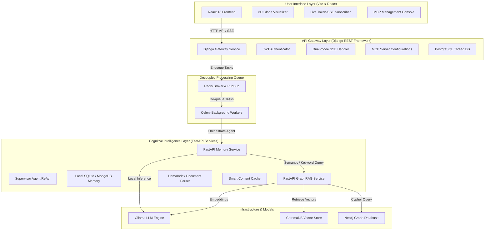
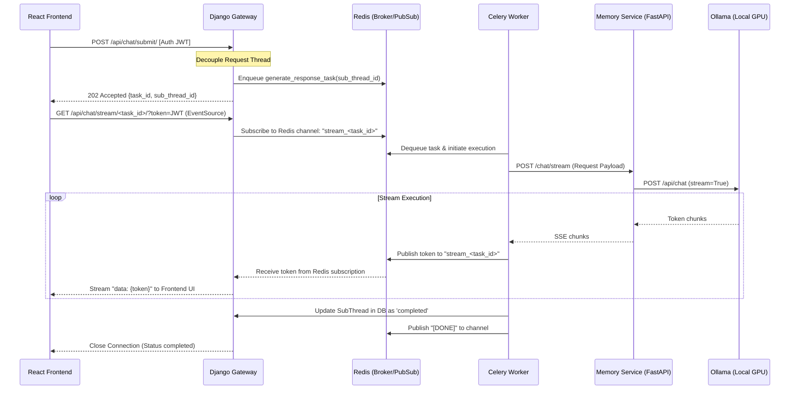

# CogniVox: Complete Master System Technical Specification

Welcome to the unified master technical specification for the CogniVox platform. This document serves as the absolute source of truth for the entire CogniVox ecosystem, describing its decoupled microservices architecture, data layer topology, setup instructions, asynchronous execution engines, API boundaries, security framework, and troubleshooting guidelines.

---

## Table of Contents
1. [System Overview & Architecture](#1-system-overview--architecture)
2. [Platform Services Breakdown](#2-platform-services-breakdown)
3. [Asynchronous Processing & Streaming Architecture (Celery, Redis & SSE)](#3-asynchronous-processing--streaming-architecture-celery-redis--sse)
4. [Master Service Orchestration & Setup Runbook](#4-master-service-orchestration--setup-runbook)
5. [Data Flow & Database Topology](#5-data-flow--database-topology)
6. [API Specifications](#6-api-specifications)
7. [Security & Authentication Framework](#7-security--authentication-framework)
8. [Monitoring, Health Checks & Diagnostics](#8-monitoring-health-checks--diagnostics)
9. [Troubleshooting Guide](#9-troubleshooting-guide)

---

## 1. System Overview & Architecture

CogniVox is an enterprise-grade, self-hosted, decoupled AI assistant platform that integrates **Retrieval-Augmented Generation (RAG)**, **multi-agent orchestration**, and the **Model Context Protocol (MCP)**. Operating entirely on local infrastructure, the system orchestrates local Large Language Models (LLMs) to ensure strict data sovereignty, low latency, and infinite extensibility.

### Core Capabilities
*   **Decoupled Architecture**: High-speed HTTP response times offloaded to back-end task queues.
*   **Asynchronous Streaming**: Real-time token-by-token streaming of agent answers and inner reasoning chains to the client.
*   **Advanced Knowledge Retrieval**: Hybrid semantic vector search combined with GraphRAG entity traversal.
*   **Model Context Protocol (MCP)**: Composable tool execution layer allowing agents to dynamically browse resources, read databases, and run terminal commands safely.
*   **Stunning 3D Visual Interfaces**: A premium React dashboard featuring real-time typing, step-by-step thinking graphs, and an interactive 3D Globe with day/night shaders.

### Master Service Architecture



---

## 2. Platform Services Breakdown

### A. React Frontend (`Agentic-frontend`)
*   **Core Tech**: React 18, TypeScript, Vite, TailwindCSS, and Material-UI.
*   **Responsibilities**:
    *   **Dynamic Chat Console**: Feeds SSE tokens into typing buffers, animating agent thinking blocks step-by-step.
    *   **3D Visualizations**: A React Three Fiber globe plotting server geolocations, day-night terminators, and document connections.
    *   **Admin Panel**: Allows administrators to register, edit, and audit MCP servers, enable or disable tools, and review system execution logs.

### B. Django API Gateway (`agentic_django`)
*   **Core Tech**: Django 5.2, Django REST Framework (DRF), and Celery.
*   **Responsibilities**:
    *   **User & Security Management**: Validates JWTs, registers users, manages subscriptions (Free/Plus/Pro quotas), and logs API calls.
    *   **Conversation Hierarchy**: Groups sub-threads inside persistent chat threads, storing conversation status and source documents in PostgreSQL.
    *   **SSE Decoupler Proxy**: Accepts queries via POST, dispatches Celery tasks, and proxies Redis PubSub token chunks down standard SSE response envelopes to the client.

### C. FastAPI Memory Service (`Agentic-Memory`)
*   **Core Tech**: FastAPI, LangChain, Starlette SSE, and MongoDB.
*   **Responsibilities**:
    *   **Supervisor Agent**: A ReAct-based orchestration agent that decomposes queries into reasoning steps, fetches memory context, and decides which MCP tools or GraphRAG engines to invoke.
    *   **Multi-level Memory**: Merges short-term session context (RAM) with long-term thread history retrieved from MongoDB collections.
    *   **MCP Integration Hub**: Acts as an MCP Client, spawning stdio/sse MCP subprocesses dynamically to run tasks.

### D. FastAPI GraphRAG Service (`Agentic-Graph-RAG`)
*   **Core Tech**: FastAPI, LlamaIndex, ChromaDB, and Neo4j.
*   **Responsibilities**:
    *   **Smart Document Ingestion**: Parses PDFs using LlamaIndex SentenceSplitters, extracts entities and relations with LLMs, and stores vectors in ChromaDB and properties in Neo4j.
    *   **Incremental Chunk Caching**: Hashes PDF files to avoid reprocessing identical documents (reducing ingestion CPU overhead by 80%).
    *   **Hybrid Search Engine**: Combines ChromaDB cosine vector search with Neo4j relational walks.

---

## 3. Asynchronous Processing & Streaming Architecture

To prevent CPU locking on the main Django threads during deep multi-step agent reasoning, a fully decoupled Celery-Redis-SSE backend was implemented.

### Decoupled Sequence Flow



### Core SSE Implementation (Django Gateway)
The streaming gateway uses a standard python `StreamingHttpResponse` to pull messages from Redis PubSub dynamically:

```python
# File: agentic_django/chat/views.py
@api_view(['GET'])
def stream_message(request, task_id):
    """
    Decoupled SSE stream reader. Validates JWT through fallback query token
    and yields Redis PubSub events directly to browser EventSource.
    """
    token = request.query_params.get('token')
    user = authenticate_sse_user(request, token)
    if not user:
        return Response({'detail': 'Unauthorized'}, status=401)

    def event_generator():
        redis_client = redis.StrictRedis(host='localhost', port=6379, db=0)
        pubsub = redis_client.pubsub()
        pubsub.subscribe(f"stream_{task_id}")
        
        try:
            for message in pubsub.listen():
                if message['type'] == 'message':
                    data = message['data'].decode('utf-8')
                    if data == "[DONE]":
                        yield "event: close\ndata: [DONE]\n\n"
                        break
                    yield f"data: {data}\n\n"
        finally:
            pubsub.unsubscribe(f"stream_{task_id}")

    return StreamingHttpResponse(event_generator(), content_type='text/event-stream')
```

---

## 4. Master Service Orchestration & Setup Runbook

CogniVox uses a custom orchestration script (`run_all_services.py`) to manage setup, docker dependencies, health tracking, and graceful execution shutdowns.

### Prerequisites
*   **Windows OS / Linux / macOS**
*   **Python 3.10+** (managed through `uv` package manager)
*   **Node.js 18+** & **npm**
*   **Docker Desktop** (Daemon must be running)

### Step-by-Step Installation Runbook

```bash
# 1. Clone your project repository
git clone <repository_url>
cd Cognivox

# 2. Run the unified setup command
# This validates your environment, installs 'uv' package manager, provisions
# virtual environments, installs all dependencies in parallel, and pulls Ollama models.
python run_all_services.py setup --auto-install

# 3. Pull required local models
python run_all_services.py pull-models

# 4. Start Docker databases and services (Redis, MongoDB, PostgreSQL, Neo4j)
python run_all_services.py start-infra

# 5. Start all active background services (Celery, Memory, GraphRAG, Django, Frontend)
python run_all_services.py run --auto-install
```

### Manual Individual Commands
If you need to debug or run individual components separately:

```bash
# Start Redis Container (Broker)
docker-compose -f docker-compose.agentic-services.yml up -d redis mongodb postgres neo4j

# Start Celery Workers (Django Directory)
cd agentic_django
celery -A agentic_django worker --loglevel=info

# Start FastAPI Memory Service
cd Agentic-Memory
uvicorn src.api.app:app --host 127.0.0.1 --port 8001 --reload

# Start FastAPI GraphRAG Service
cd Agentic-Graph-RAG
uvicorn src.api.app:app --host 127.0.0.1 --port 8002 --reload

# Start Django Web Server
cd agentic_django
python manage.py runserver 127.0.0.1:8000

# Start Frontend Vite Server
cd Agentic-frontend
npm run dev
```

---

## 5. Data Flow & Database Topology

The CogniVox platform relies on a hybrid relational, document, vector, and graph data layer designed for performance and integrity.

```
                  ┌──────────────────────┐
                  │    User Actions      │
                  └──────────┬───────────┘
                             │
                             ▼
         ┌───────────────────┴───────────────────┐
         │ Django API Gateway (SQLite/Postgres)  │
         │ - Users, Sessions, and Subscriptions  │
         │ - Conversation Threads & SubThreads   │
         │ - Audit Logs & MCP Configurations     │
         └──────────┬───────────────────┬────────┘
                    │                   │
     Celery Tasks   │                   │   Agent History
     (Redis Queue)  ▼                   ▼   (MongoDB Collections)
    ┌───────────────┴───┐       ┌───────┴───────────┐
    │    Celery/Redis   │       │   MongoDB Store   │
    │  - Task Broker    │       │  - Chat History   │
    │  - PubSub Streaming│      │  - User Profiles  │
    └───────────────────┘       └───────────────────┘
                                        ▲
                       Graph Queries    │    Vector Sim
                       (Cypher API)     │    (ChromaDB API)
                      ┌─────────────────┴───┬───────────────┐
                      │    Neo4j Graph      │   ChromaDB    │
                      │  - Entity Nodes     │  - Paragraph  │
                      │  - Relational Edges │    Embeddings │
                      └─────────────────────┴───────────────┘
```

*   **Django Database (PostgreSQL / SQLite)**: Core system states, relational structures, user settings, subscriptions, spaces, and threat metadata.
*   **Redis**: Key-value data broker, Celery task metadata queue, and real-time SSE PubSub message buffers.
*   **MongoDB**: Storage for highly dynamic conversation history collections, step-by-step thinking graphs, and user-profile caches.
*   **ChromaDB**: Native fast semantic vector search database holding document chunk embeddings (`nomic-embed-text`).
*   **Neo4j**: Knowledge graph database storing entities, relationships, chunk nodes, and visual relationships.

---

## 6. API Specifications

### A. Authentication Endpoints (Django Gateway)
*   `POST /api/auth/register/` - Create a new user (initializes Free subscription).
*   `POST /api/auth/token/` - Obtain JWT access and refresh tokens.
*   `POST /api/auth/token/refresh/` - Refresh expired JWT tokens.
*   `GET /api/auth/me/` - Retrieve active user profile, permissions, and subscription limits.

### B. Chat & Stream Execution (Django Gateway)
*   `POST /api/chat/submit/`
    *   *Payload*:
        ```json
        {
          "thread_id": "uuid-string",
          "query": "What is the company policy on remote work?",
          "response_mode": "agentic",
          "n_results": 20
        }
        ```
    *   *Response*: Returns `202 Accepted` immediately.
        ```json
        {
          "task_id": "celery-uuid-task-id",
          "sub_thread_id": "database-subthread-uuid",
          "status": "accepted"
        }
        ```
*   `GET /api/chat/stream/<task_id>/`
    *   *Headers*: `Accept: text/event-stream`
    *   *Parameters*: `?token=<JWT_string>`
    *   *SSE Yield*: Returns real-time token events and thinking blocks, concluding with a `close` event.

### C. MCP Server Configuration (Django Gateway - Admin Only)
*   `GET /api/mcpserver/servers/` - List registered MCP Servers.
*   `POST /api/mcpserver/servers/` - Register a new stdio or sse MCP server.
*   `POST /api/mcpserver/servers/<id>/toggle_active/` - Enable or disable an MCP server connection.

### D. Document Processing & Knowledge Graph (GraphRAG)
*   `POST /api/graphrag/upload/` - Upload local documents (PDF).
*   `POST /api/graphrag/ingest/` - Build chunks, write embeddings to ChromaDB, and save entities to Neo4j.
*   `GET /api/graphrag/visualize/` - Retrieve knowledge graph nodes and connections for frontend 3D rendering.

---

## 7. Security & Authentication Framework

CogniVox employs a multi-layered security model to protect proprietary enterprise data:

### 1. Dual-Mode JWT Validation
Every API gateway request requires JWT token validation. For standard endpoints, validation occurs via the `Authorization: Bearer <token>` header. For streaming SSE paths (`EventSource`), the token is validated through query parameters. If validation fails, the socket is immediately closed.

### 2. Role-Based Access Control (RBAC)
User actions are restricted by user roles:
*   `user` (Standard Access): Authorized to manage personal spaces, execute conversations, and view semantic documents.
*   `admin` (System Administrator): Full access to write global prompt configs, create/delete database settings, view execution performance, and configure system-level MCP toolkits.

### 3. Request Quota Limits
Users are rate-limited based on subscription plans (stored in the `subscription_plans` database table):
*   **Free**: Max 20 requests per month.
*   **Plus**: Max 100 requests per month.
*   **Pro**: Max 200 requests per month.

---

## 8. Monitoring, Health Checks & Diagnostics

CogniVox tracks the health of all systems using the master orchestrator script. It runs live TCP/HTTP checks and records response delays in milliseconds.

```python
# File: run_all_services.py (Status Checker class)
class ServiceHealthMonitor:
    def verify_service_health(self):
        services = {
            "Redis Broker": ("127.0.0.1", 6379),
            "Postgres SQL": ("127.0.0.1", 5432),
            "Django Gateway": ("127.0.0.1", 8000),
            "FastAPI Memory": ("127.0.0.1", 8001),
            "FastAPI GraphRAG": ("127.0.0.1", 8002)
        }
        
        for name, (ip, port) in services.items():
            s = socket.socket(socket.AF_INET, socket.SOCK_STREAM)
            s.settimeout(1.0)
            try:
                s.connect((ip, port))
                print(f"✅ {name} on port {port} is healthy.")
            except socket.error:
                print(f"❌ {name} on port {port} is UNREACHABLE!")
            finally:
                s.close()
```

---

## 9. Troubleshooting Guide

Here are common issues developers or administrators may face, along with instructions to resolve them:

### A. Celery Worker Fails to Startup
*   **Symptoms**: Celery throws connection errors or fails to register.
*   **Cause**: The Redis message broker is down or port `6379` is blocked.
*   **Resolution**: 
    1. Verify Redis is running: `docker ps | grep redis`.
    2. Start the container manually if stopped: `docker start agentic-redis`.
    3. Run Celery with high verbose output: `celery -A agentic_django worker --loglevel=debug`.

### B. Django FieldError (Database Relation Missing)
*   **Symptoms**: When querying subthreads, Django crashes with `FieldError` regarding `chat_thread`.
*   **Cause**: A legacy backend migration referencing the field `chat_thread` instead of `parent_thread`.
*   **Resolution**: Ensure `ChatSubThread.objects.filter()` points to `parent_thread__user` instead of `chat_thread__user`. Check `views.py` and run a migration check: `python manage.py makemigrations`.

### C. Chat Streaming Outputs static offline mock responses
*   **Symptoms**: Real-time token streaming is bypassed, and the chat yields static, generic fallback templates.
*   **Cause**: The React frontend status validator rejected the `202 Accepted` response because it was strictly configured to expect `200` or `201` codes.
*   **Resolution**: In `Chat.tsx`, locate status checks and add `202` to the allowed status codes:
    ```typescript
    if (response.data && (response.status === 200 || response.status === 201 || response.status === 202)) {
      // Connect to EventSource...
    }
    ```

### D. Neo4j Memory Allocation Thrashing
*   **Symptoms**: System hangs or restarts during document ingestion.
*   **Cause**: Neo4j JVM heap has exceeded local container limits.
*   **Resolution**: In `docker-compose.agentic-services.yml`, increase memory configurations for the `neo4j` service:
    ```yaml
    environment:
      - NEO4J_dbms_memory_heap_initial__size=512m
      - NEO4J_dbms_memory_heap_max__size=1g
    ```

---

## Conclusion

The CogniVox ecosystem leverages modern microservice design principles, local GPU acceleration, and background task queues to deliver a production-grade AI platform. This comprehensive technical guide provides developers and administrators with the foundation required to deploy, build, and optimize CogniVox.